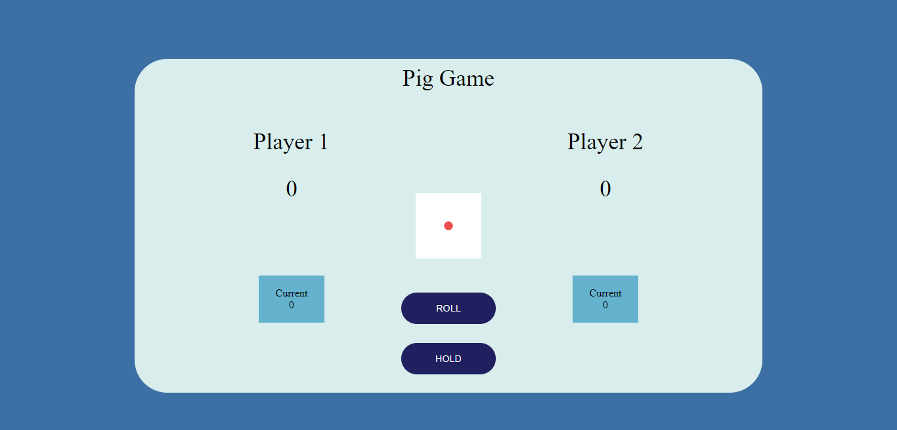

# Pig-Game
Pig Game using ES6 classes

## 1. Introduction

Pig Game web app built with HTML5, CSS3 and vanilla JS.

## 2. How It Works

The application allows the players to enter a final score. Once the final score is entered, the game begins! The first player to reach the final score wins the game. If a player rolls a 1, that player loses all of his round score.

